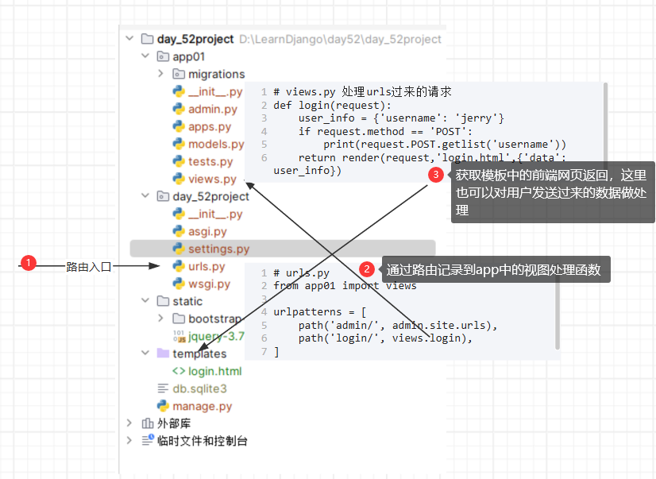
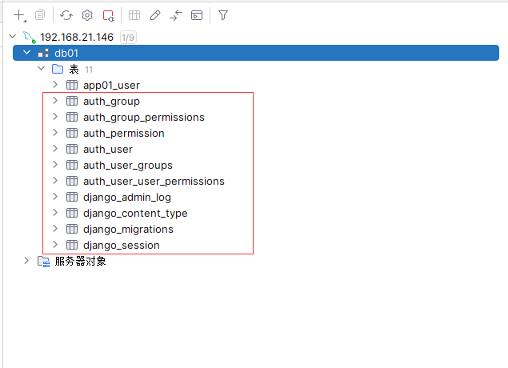

# LearnDjango
学习django框架使用的库

## cs与bs架构

1. 客户端   服务端
2. 浏览器   服务端
本质:bs也是cs

## HTTP协议

四大特性

1. 基于TCP/IP作用于应用层的协议
2. 基于请求响应
3. 无状态
    cookie,session,token
4. 无连接
    长连接:websocket


## 响应状态码

- 1XX
- 2XX
- 3XX
- 4XX
- 5XX


## 动静态网页
静态网页
	数据是写死的,万年不变
动态网页
	数据不是写死的 是动态获取到的
	比如:
		1.后端实时获取当前时间"传递"给前端页面展示
		2.后端从数据库获取数据"传递"给前端页面展示

传递给前端页面   >>>    页面渲染


## jinja2

```bash
pip3 install jinja2
```

由于flask框架是依赖于jinja2的 所以下载flask框架也会自带jinja2模块

模板的渲染 包含了 模板语法

模板语法(贴近python语法)
前端也能够使用后端的一些语法 操作后端传入的数据
```jinja2
# 渲染变量
<p>{{data}}</p>
<p>{{data['username']}}</p>
<p>{{data.password}}</p>
<p>{{data.get('hobby')}}</p>

# 循环展示

	<tr>
		<td>{{user_dict.id}}</td>
		<td>{{user_dict.name}}</td>
		<td>{{user_dict.password}}</td>
	</tr>


```


1.纯手撸web框架
	1.手动书写socket代码
	2.手动处理http数据

2.基于wsgiref模块帮助我们处理scoket以及http数据
	wsgiref模块
		1.请求来的时候 解析http数据 帮你打包成一个字典传输给你 便于你操作各项数据
		2.响应走的时候 自动帮你把数据再打包成符合http协议格式的样子 再返回给前端
		
3.封装路由与视图函数对应关系  以及视图函数文件网站用到的所有的html文件全部放在了
templates文件夹下
	1.urls.py 路由与视图函数对应关系
	2.views.py  视图函数(视图函数不单单指函数 也可以是类)
	3.templates  模板文件夹

4.基于jinja2实现模板的渲染
	模板的渲染
	后端生成好数据 通过某种方式传递给前端页面使用(前端页面可以基于模板语法更加快捷简便使用后端传过来的数据)


## Web框架
​	python三大主流web框架
​		1.Django:大而全 自带的功能特别特别多  就类似于航空母舰  有时候过于笨重
​		2.Flask:短小精悍  自带的功能特别特别少  全都是依赖于第三方组件
​			flask框架第三方的组件特别多 如果把flask第三方全部加起来  完全可以盖过Django
​			比较受限于第三方的开发者
​		3.Tornado:天生的异步非阻塞框架    速度特别快 能够抗住高并发
​			可以开发游戏服务器
​			
​		
​		A:socket
​		B:路由与视图函数匹配
​		C:模板语法


​		
​		Django
​			A:用的别人的 wsgiref
​			B:自己写的
​			C:自己写的  
​		Flask
​			A:用的别人的 wsgiref>>> werkzeug
​			B:自己写的
​			C:用的别人的 jinja2
​		Tornado
​			A,B,C全都是自己写的
​		
## Django



​	注意事项
​		1.你的计算机的名称不能有中文
​		2.文件的命名尽量也不要用中文
​		3.一个pycharm窗口只能有一个项目 不要把多个项目放在一个窗口下
​		
​	
​	django版本问题
​		1.x  2.x
​		
​		以django1.11版本为主
​	django下载
​		pip3 install django==1.11.11
​	如何确认是否下载成功
​		命令行敲 django-admin


## 如何创建django项目
命令行式
1.命令行创建django项目
```python
django-admin startproject 项目名
```

2.命令行创建django应用(一个应用对应一块儿独立的功能)

```python
django-admin startapp 应用名
python manage.py startapp 应用名
```

3.命令行启动django项目

```ptyhon
python manage.py runserver
```

	(******)
	注意 用命令行创建django项目  不会自动新建templates模板文件夹
	需要你自己手动创建 并且需要你自己去settings.py文件中注册该文件路径
**创建的应用一定要在settings中注册才能生效否则无法识别**

```python
# settings.py

		INSTALLED_APPS = [
				'django.contrib.admin',
				'django.contrib.auth',
				'django.contrib.contenttypes',
				'django.contrib.sessions',
				'django.contrib.messages',
				'django.contrib.staticfiles',
				# 'app01'  # 简写
				'app01.apps.App01Config'  # 全称
			]
```


## django主要文件介绍

```bash
项目名文件
	同名的项目文件夹
		settings.py  django暴露给用户可配置的文件
		urls.py      路由与视图函数对应关系
	manage.py  django入口文件
	应用文件夹
		migrations文件夹   数据库迁移记录
		admin.py  django后台管理
		apps.py   应用注册相关
		models.py  orm模型类
		tests.py   测试文件
		views.py   视图函数
```

##　django小白必会三板斧

HttpResponse: 返回字符串
render: 返回html页面 并且能够给该页面传值
redirect: 重定向

## 静态配置文件

html文件默认全都放在templates文件夹下
对于前段已经写好了的文件 我们只是拿过来使用 那么这些文件都可以称之为叫"静态文件"
静态文件可以是

- bootstrap一类的前段框架 已经写好了的
- 图片
- css
- js

静态文件默认全都放在static文件夹下，static文件夹中默认会默认创建的子文件夹
- css文件夹  当前网站所有的样式文件
- js文件  当前网站所有的js文件
- img文件  当前网站所有的图片文件
- 其他(前端框架代码 第三方插件代码...)

**用户可以访问的资源都在url中只有url中开设相关的资源你才能访问到**
后端资源一般都需要手动指定是否需要暴露给用户
	
静态文件配置

```python
# settings.py
STATICFILES_DIRS = [
		os.path.join(BASE_DIR,'static')
]
```

你只要输入static文件夹内具体文件的路径就能够访问到
静态文件是从上向下加载,加载到满足条件的就停止。

```python
# 这个static不是文件夹的名字 而是接口前缀
# 只要你想访问静态文件中的资源 文件路径就必须用static开头
# settings.py
STATIC_URL = '/static/'  

# 手动将static文件夹中所有的资源暴露给用户
STATICFILES_DIRS = [
	os.path.join(BASE_DIR,'static'),  # 真正的文件夹路径
	os.path.join(BASE_DIR,'static1'),  # 真正的文件夹路径
	os.path.join(BASE_DIR,'static2'),  # 真正的文件夹路径
	os.path.join(BASE_DIR,'static3')  # 真正的文件夹路径
]
```

django默认是支持自动重启代码的所以你只需要多刷新几次页面就可以
但是有时候它的重启机制比较慢
- 机制:实时监测文件代码变化只要有变化就会自动重启 
- 可能你的代码还没有写完这个时候就会自动报错


静态文件接口前缀"动态解析"
```html

<!DOCTYPE html>
<html lang="en">
<head>
    <meta charset="UTF-8">
    <title>登录</title>
    <script src=""></script>
    <link rel="stylesheet" href="">
    <script src=""></script>
    <link rel="stylesheet" href="https://lf3-cdn-tos.bytecdntp.com/cdn/expire-1-M/font-awesome/4.7.0/css/font-awesome.min.css">
</head>
```


## 获取表单内容

form表单默认是get请求
携带数据的方式是url问好后跟数据
http://127.0.0.1:8000/login/?username=zekai&password=123
	
可以通过前面input标签中的属性method改为post请求
改成post请求之后需要去settings文件中注释掉一个中间件，这样设置可以跳过浏览器生成的cookie

```python
# settings.py
		MIDDLEWARE = [
			'django.middleware.security.SecurityMiddleware',
			'django.contrib.sessions.middleware.SessionMiddleware',
			'django.middleware.common.CommonMiddleware',
			# 'django.middleware.csrf.CsrfViewMiddleware',
			'django.contrib.auth.middleware.AuthenticationMiddleware',
			'django.contrib.messages.middleware.MessageMiddleware',
			'django.middleware.clickjacking.XFrameOptionsMiddleware',
		]
```

form表单提交数据目的地由action属性决定

		1. 不写的情况下 默认往当前地址提交
		2. 还可以写后缀/index/(将项目常用这种)
		3. 还可以写全路径

视图函数一般主要会先处理get请求

```python
def login(request):
	# 视图函数针对不同的请求方式 应该有不同的处理逻辑
	# if request.method == 'GET':
	#     print('收到了')
	#     print(request.method)  # 能够获取前端请求方式 并且是全大写的字符串
	#     print(type(request.method))
	#     return render(request,'login.html')
	# elif request.method == 'POST':
	#     # 获取用户输入 做相应的逻辑判断
	#     return HttpResponse("拿到了 老弟")
    # 针对POST方法做单独的处理，用户提交表单了，这样代码逻辑更加清晰，其它请求直接返回
	if request.method == 'POST':
		return HttpResponse('来啦 宝贝')
	return render(request,'login.html')
```

### 获取前端数据
request.method 获取请求方法

对数据的处理不单单只有wsgiref模块django后端也进行了大量的数据处理

在视图函数中request有wsgiref和django的处理，要查看request携带的详细信息，可以通过IDE debug的方式查看

GET

```python
# 获取前端get提交的数据(就类似于是一个大字典)
request.GET 
        # 取值
        # 虽然value是一个列表但是默认只取列表最后一个元素
        # 强烈不建议你使用中括号的形式取值
    	request.GET.get('username')
    	
    	# 如果想直接把列表全部取出(***重要***)
        # 推荐使用这种方式，如果同一个字段有多个值的情况就可以全部取到，然后再进行处理
    	request.GET.getlist('hobby')
```

POST
```python
# 获取前端post提交的数据(就类似于是一个大字典)
request.POST 
    # 取值
    # 虽然value是一个列表 但是默认只取列表最后一个元素
    # 强烈不建议你使用中括号的形式取值
	request.POST.get('username') 
	
	# 如果想直接把列表全部取出(******)
	request.POST.getlist('hobby')
```


## django 连接数据库

django默认使用的是自带的sqlite数据库 
如果你想让它其他的数据库需要在settings配置文件中配置
1.settings文件中配置

```python
# settings.py 
        DATABASES = {
    'default': {
        'ENGINE': 'django.db.backends.mysql',
        'NAME': 'day51', # 数据名称
        'HOST':'127.0.0.1',
        'PORT':3306,
        'USER':'root',
        'PASSWORD':'123',
        'CHARSET':'utf8'
    }
```

2.还要在项目名下或者是app名下的`__init__.py`文件中告诉django不要使用默认的mysqldb,而是使用pymysql

```python
import pymysql
pymysql.install_as_MySQLdb()
```
## [day53]()

## django ORM

### ORM对象关系映射

| 表           | 类           |
| ------------ | ------------ |
| 一条条记录   | 对象         |
| 字段对应的值 | 对象属性属性 |


首先需要在应用下的models.py中书写模型类
```python
class User(models.Model):
	# 将id字段设置为User表主键字段  在django orm中 你可以不写主键字典  django会默认给你的表创建一个名为id的主键字段
	# id = models.AutoField(primary_key=True)  # 一旦你自己指定了主键字段 那么django就不会自动再帮你创建了
	username = models.CharField(max_length=32)  # username varchar(32)   CharField必须要指定max_length参数
	password = models.IntegerField()  # password int
```
| 字段                                        | mysql中的类型                     |
| ------------------------------------------- | --------------------------------- |
| CharField(max_length=32)                    | varchar(32)                       |
| IntegerField                                | int                               |
| IntegerField(null=True)                     | 允许为空                          |
| CharField(max_length=32, default='China')   | 默认值china                       |
| DecimalField(max_digits=8,decimal_places=2) | 浮点型，总共8位，保留小数点后两位 |
|                                             |                                   |

**需要执行数据库迁移(同步)命令**,只要修改了模型就必须这样修改。

```python
# 仅仅是在小本本上(migrations文件夹)记录数据库的修改 并不会直接操作数据
python3 manage.py makemigrations

# 将数据库修改记录 真正同步到数据库
python3 manage.py migrate

注意:只要动了models中跟数据库相关的代码就必须重新执行上面的两条命令缺一不可(******)

```

实际上只生成了一个app01_user的表，加上一个app01的前缀可以区分每个不同app中有相同名称的表重复，其它的表都是django生成的表。



### 表字段的增删改查

**注意:只要动了models中跟数据库相关的代码 就必须重新执行上面的两条命令缺一不可**

增
```python
# 当一张表已经创建出来之后 后续还想添加字段,可以有两种方式
# 1.给新增的字段设置默认值
	addr = models.CharField(max_length=32,default='China')  # default该字段默认值
# 2.给新增的字段设置成可以为空
	age = models.IntegerField(null=True)  # 该字段允许为空
```

删(慎用)

- 删除字段直接在models.py中注释该字段然后重新执行两条命令即可
- 注意:执行完之后 表中该字段所对应的所有的数据全部删除
- 并且一般情况下 基本是不会用到真正意义上的删除


orm操作需要使用models中的类的名字

### 数据操作

查数据有两种方法`get`和`filter`数据库中没有get的数据的时候，代码会报错，所以推荐使用filter的方式。

```python
from app01 import models

models.User.objects.all()  # 直接拿所有的数据

models.User.objects.get(username=username)  

res = models.User.objects.filter(username=username)
res.query 

user_obj = res.first()
```

数据的增
```python
1.
models.User.objects.create(username=username,password=password)
# 2.save方法会更新全部字段的内容，即使是只修改了一个字段。
user_obj = models.User(username=username,password=password)
user_obj.save()
```

删
```python
models.User.objects.filter(条件).delete()
```

改
```python
# 推荐使用update方法
models.User.objects.filter(条件).update('key'='value')

        filter拿到是一个列表,filter操作其实都是批量操作
        如果filter结果列表中有多个数据那么会一次性全部修改 
        类似于for循环一个个修改.
        
# 方式二(不推荐使用)
edit_obj.username = username
edit_obj.password = password
edit_obj.save()
"""
第二种方式会从头到尾将所有的字段全部修改一遍  效率极低
"""
```

用户的增删改查
1.通过orm展示所有的到前端
	all()
	模板语法for循环


2.添加新增按钮 (用户的新增操作)
	a标签的href直接触发后端逻辑
	create()


3.添加编辑 删除按钮
	编辑
	删除
		利用get请求携带参数的特点  在url的后面跟上对应数据的id值
		request.GET.get()

如果是编辑 
	重新渲染一个页面 将编辑对象传递到前端

如果是删除
	直接利用filter(...).delete()


图书管理系统表关系设计


多对多：书和出版社联合出版，一个出版社出版多本书。

一对多：一个作者出版多本书。

一对一：用户和用户详情，用户的唯一id对应用的详情表。

### 表与表之间建立联系

django orm中表与表之间建关系。

多对多会建立第三张表去做中间的映射。to后面的是表的名字。默认情况下会与表的主键id相关联。

|        |                                  |
| ------ | -------------------------------- |
| 一对多 | ForeignKey(to='Publish')         |
| 一对一 | OneToOneField(to='AuthorDetail') |
| 多对多 | ManyToManyField(to='Author')     |
|        |                                  |

使用方式：

```python

```

注意:
前面两个关键字会自动再字段后面加_id
最后一个关键字 并不会产生实际字段 只是告诉django orm自动创建第三张表。

## 路由层urls.py

url()方法第一个参数其实是一个正则表达式一旦前面的正则匹配到了内容就不会再往下继续匹配而是直接执行对应的视图函数正是由于上面的特性当你的项目特别庞大的时候url的前后顺序也是你需要你考虑极有可能会出现url错乱的情况。

django在路由的匹配的时候，当你在浏览器中没有敲最后的斜杠django会先拿着你没有敲斜杠的结果取匹配如果都没有匹配上，会让浏览器在末尾加斜杠再发一次请求再匹配一次，如果还匹配不上才会报错。

如果你想取消该机制不想做二次匹配可以在settings配置文件中指定:
```bash
APPEND_SLASH = False  # 该参数默认是True
```

django3.2版本中使用的是

```bash
from django.urls import re_path

urlpatterns = [
    re_path(r'^articles/(?P<year>\d+)/$', views.year_archive),
]
```

默认路由

```python
r'^$'
```


### 无名分组

必须是一个分组才行。

```python
urls     url(r'^test/([0-9]{4})/', views.test)
# 路由匹配的时候会将括号内正则表达式匹配到的内容当做位置参数传递给视图函数。
views    test(request,2019)
```

### 有名分组

```python
urls		url(r'^test/(?P<year>\d+)/', views.test)
# 路由匹配的时候会将括号内正则表达式匹配到的内容当做关键字参数传递给视图函数
views		test(request,year=2019)
```

注意：无名有名不能混合使用 !!!

同一种分组可以重复使用。

```python
# 无名分组支持多个
# url(r'^test/(\d+)/(\d+)/', views.test),
# 有名分组支持多个
# url(r'^test/(?P<year>\d+)/(?P<xx>\d+)/', views.test),
```

### 反向解析

本质:其实就是给你返回一个能够返回对应url的地址，就是给路由一个别名，在`urls.py`修改了路由之后，前端或者后端都能够通过别名来把修改的部分解析出来。
		
1.先给url和视图函数对应关系起别名

```python
url(r'^index/$',views.index,name='kkk')
```

2.反向解析
后端反向解析，后端可以在任意位置通过reverse反向解析出对应的url；前提是函数需要满足接收正则匹配到的参数，如果正则中有分组信息，但是函数中没有分组，就报导致函数传参错误。

### 无分组信息的反向解析

```python
from django.shortcuts import render,HttpResponse,redirect,reverse

def xxx(request):
    print(reverse('kkk'))
    
# 前端反向解析，从url中的kkk别名中来的
	

path('index111/', app01_views.index, name='app01_index'),
# 这里会把href中的链接直接解析为index111/所以无论后端如何修改，前端的url也会跟着修改
<a href="">index9</a>
```

### 无名分组反向解析

```python
url(r'^index/(\d+)/$',views.index,name='kkk')

# 后端反向解析
	reverse('kkk',args=(1,))  # 后面的数字通常都是数据的id值
# 前端反向解析
	   # 后面的数字通常都是数据的id值

# 无名分组的使用和写法
# urls
re_path('^index/(\d+)/', app01_views.index, name='app01_index'),

# views
def index(request,*args):
    # 注意这里渲染的始终是一个容器如列表，元祖等
    print(reverse('app01_index',args=args))
    return render(request, 'index.html')

# index.html
<body>
<a href="123/">index2</a>
<a href="456/">index3</a>
</body>
```

实际使用场景编辑用户对id的渲染

```python
"""
url(r'^edit_user/(\d+)/',views.edit_user,name='aaa'),


<a href="edit_user/{{edit_obj.id}}/">编辑</a>


def edit_user(request,edit_id):
    reverse('aaa',args=(edit_id,))
```

### 有名分组反向解析

同无名分组反向解析意义的用法		

```python
url(r'^index/(?P<year>\d+)/$',views.index,name='kkk')
		
# 后端方向解析
print(reverse('kkk',args=(1,)))  # 推荐你使用上面这种减少你的脑容量消耗
print(reverse('kkk',kwargs={'year':1}))

前端反向解析

<a href="">1</a>  # 推荐你使用上面这种减少你的脑容量消耗
<a href="">1</a>
```

```python
# 换种写法urls.py
re_path(r'^test/(?P<year>\d+)/$', app01_views.test_named, name='app01_test_named'),

# views.py
def test_named(request, year=None):
    print(year)
    return HttpResponse('uri number is {}'.format(year))

# 匹配的结果
/test/2025/
```

```python
# 这里在定义了之后同样会打印定义的值
# views.py
def test_named(request, year=None):
    print(year)
    print('rev: ', reverse('app01_test_named', kwargs={'year': 2029}))
    return HttpResponse('uri number is {}'.format(year))

rev:  /test/2029/
```
注意:在同一个应用下别名千万不能重复!!!

### 路由分发

当你的django项目特别庞大的时候,路由与视图函数对应关系特别特别多。
那么你的总路由urls.py代码太过冗长不易维护。
`每一个应用都可以有自己的urls.py,static文件夹,templates文件夹`
正是基于上述条件可以实现多人分组开发等多人开发完成之后我们只需要创建一个空的django项目，然后将多人开发的app全部注册进来在总路由实现一个路由分发而不再做路由匹配(来了之后 我只给你分发到对应的app中)。
当你的应用下的视图函数特别特别多的时候你可以建一个views文件夹里面根据功能的细分再建不同的py文件(******)

```python
# 在urls.py中导别名，include中就可以直接写as的别名
from app01 import views as app01_views
from app02 import views as app02_views

# 主urls.py
        urlpatterns = [
			url(r'^admin/', admin.site.urls),
            # 推荐使用这种用法
			url(r'^app01/',include('app01.urls')),
			url(r'^app02/',include('app02.urls')),
		]
    
# app01 urls.py
urlpatterns = [
    path('index/', views.list_book, name='app01_list'),
]

# app02 urls.py
urlpatterns = [
    path('index/', views.app02_index, name='app02_index'),
]
```

### 名称空间

给每个app的url.py中一个名称，然后名称空间中引用。

多个app起了相同的别名 这个时候用反向解析 并不会自动识别应用前缀。
如果想避免这种问题的发生。

```bash
方式1:
	总路由，总路由中一级路由的后面千万不加$符号
		url(r'^app01/',include('app01.urls',namespace='app01'))
		url(r'^app02/',include('app02.urls',namespace='app02'))
	后端解析的时候
		reverse('app01:index')
		reverse('app02:index')
	前端解析的时候
		
		

方式2: 不使用名称空间:
	起别名的时候不要冲突即可一般情况下在起别名的时候通常建议以应用名作为前缀
		name = 'app01_index'
		name = 'app02_index'
```

django 3.2版本的配置

```python
# 主urls.py中配置
    path(r'app02/',include('app02.urls', namespace='app02')),
    path(r'app01/',include('app01.urls', namespace='app01')),
    
# app01 urls.py的配置
    # 必须定义app_name，就是主路由中定义的namespace
	app_name = 'app01'
    urlpatterns = [
        path('index/', views.list_book, name='app01_list'),
    ]
    
# app02 urls.py的配置
    app_name = 'app01'
    urlpatterns = [
        path('index/', views.list_book, name='app01_list'),
    ]
```

## 伪静态

静态网页:数据是写死的万年不变。

伪静态网页的设计是为了增加百度等搜索引擎seo查询力度。

所有的搜索引擎其实都是一个巨大的爬虫程序。

网站优化相关 通过伪静态确实可以提高你的网站被查询出来的概率。

## 虚拟环境

一般情况下我们会给每一个项目配备该项目所需要的模块不需要的一概不装虚拟环境就类似于为个项目量身定做的解释器环境。
每创建一个虚拟环境就类似于你又下载了一个全新的python解释器。

## django版本路由的区别

### django1.X跟django2.X版本区别
路由层1.X用的是url,而2.X用的是path

2.X中的path第一个参数不再是正则表达式,而是写什么就匹配什么 是精准匹配

当你使用2.X不习惯的时候 ,2.X还有一个叫re_path
2.x中的re_path就是你1.X的url


虽然2.X中path不支持正则表达式  但是它提供了五种默认的转换器

1.0版本的url和2.0版本的re_path分组出来的数据都是字符串类型。
默认有五个转换器，感兴趣的自己可以课下去试一下

- str,匹配除了路径分隔符（/）之外的非空字符串，这是默认的形式
- int,匹配正整数，包含0。
- slug,匹配字母、数字以及横杠、下划线组成的字符串。
- uuid,匹配格式化的uuid，如 075194d3-6885-417e-a8a8-6c931e272f00。
- path,匹配任何非空字符串，包含了路径分隔符（/）（不能用？）


```python
path('index/<int:id>/',index)  # 会将id匹配到的内容自动转换成整型
```

访问 /index/12346  id传到后端是一个kv的形式传递到后端的`id=123456`所以后端接收要么接收任意关键字参数要么接收，位置参数`id`

```python
# urls.py
path(r'pipei/<int:num>/', app01_views.pipei, name='pipei'),

# 处理的函数
def pipei(request,**kwargs):
    print(kwargs)
    return HttpResponse(b'hello baby')

# 方式二：
def pipei(request,num):
    print(num)
    return HttpResponse(b'hello baby')
```


### 自定义转换器

```python
class FourDigitYearConverter:  
regex = '[0-9]{4}'  
def to_python(self, value):  
	return int(value)  
def to_url(self, value):  
	return '%04d' % value  占四位，不够用0填满，超了则就按超了的位数来！
register_converter(FourDigitYearConverter, 'yyyy')  
			
urlpatterns = [  
		path('articles/2003/', views.special_case_2003),  
		path('articles/<yyyy:year>/', views.year_archive),  
		...  
	]  
```


## 前后端分离

前端一个人干(前端转成自定义对象)
	JSON.stringify()        json.dumps()
	JSON.parse()		json.loads()
后端另一个干(python后端用字典)
只要涉及到数据交互,一般情况下都是用的json格式
后端只负责产生接口,前端调用该接口能拿到一个大字典
后端只需要写一个接口文档 里面描述字典的详细信息以及参数的传递。

## 返回JSON对象

可以被序列化的对象都可以当作json返回。


```python
# 方法一：
def return_json(request):
    data = {'name': '我是papi', 'age': 18}
    res = json.dumps(data,ensure_ascii=False) # 不把内容进行转码
    return HttpResponse(res)

# 方法二：
def return_json(request):
    data = {'name': '我是papi', 'age': 18}
    return JsonResponse(data, json_dumps_params={'ensure_ascii': False})

```

如果直接返回json的对象需要加

```python
return JsonResponse(l,safe=False)
```

request.get_full_path() 能够打印get请求过来的参数。
request.path 只能能够打印uri部分。

```python
/json/?id=123456
/json/
```

## 上传文件

```bash
# 前端实现
            <form action="" enctype="multipart/form-data">
              <div class="form-group">
                <input type="file" class="form-control">
              </div>
                
              <button href="" type="submit" class="btn btn-primary pull-right" formmethod="post" style="margin-top: 10px">保存</button>
            </form>
            
# 路由
path(r'up/',app01_views.upload_file,name='up'),

# 后端代码
def upload_file(request):
    if request.method == 'POST':
        file_obj = request.FILES.get('uploadfile')
        print(file_obj.name) # 文件名
        with open(file_obj.name, 'wb') as f:
            for line in file_obj.chunks():
                f.write(line)
        return HttpResponse('收到了!')
    return render(request,'uploadfile.html')
```


request方法总结
	request.method
	request.GET
	request.POST
	request.FILES
	request.body  # 原生的二进制数据

RBAC (role based access control)
基于角色的权限管理

当你在做权限管理的时候 需要用到
在web领域权限就是一个个的url
简单判断用户是否有权限访问某个url思路
	获取用户想要访问的url
	与数据库中该用户可以访问的url进行对比


## [day54]()

djiango中配置文件的配置，

```bash
# 如果xxx不存在就会使用后者的配置
os.environ.setdefault('xxx','conf.settings')
```


## render原理

返回的还是标准的HttpResponse

```bash
from django.template import Template,Context
def re(request):
    temp = Template('<h1>{{ user }}</h1>')
    con = Context({"user":{"name":'jason',"password":'123'}})
    res = temp.render(con)
    print(res)
    return HttpResponse(res)
```


## FBV与CBV

视图函数并不只是指函数 也可以是类
	FBV(基于函数的视图) 面向函数式编程
	CBV(基于类的视图)   面向对象式编程
问题:基于CBV的视图函数 
get请求来就会走类里面get方法,post请求来就会走类里面post方法 为什么???

```python
urls.py中
	url(r'^login/',views.MyLogin.as_view())
views.py中
	from django.views import 
	class MyLogin(View):
		def get(self,request):
			print("from MyLogin get方法")
			return render(request,'login.html')
		def post(self,request):
			return HttpResponse("from MyLogin post方法")


研究方向 
	1.从url入手
    # 由于函数名加括号执行优先级最高,所以这一句话一写完会立刻执行as_view()方法
	url(r'^login/',views.MyLogin.as_view())  
	
	@classonlymethod
	def as_view(cls, **initkwargs):  # cls就是我们自己的写的类 MyLogin
		def view(request, *args, **kwargs):
			self = cls(**initkwargs)  # 实例化产生MyLogin的对象  self = MyLogin(**ininkwargs)
			if hasattr(self, 'get') and not hasattr(self, 'head'):
				self.head = self.get
			self.request = request
			self.args = args
			self.kwargs = kwargs
			# 上面的几句话都仅仅是在给对象新增属性
			return self.dispatch(request, *args, **kwargs)  # dispatch返回什么浏览器就会收到什么
			# 对象在查找属性或者方法的时候,你一定要默念:
            1.先从对象自己这里找
            2.然后从产生对象的类里面找
            3.最后类的父类依次往后
		return view
	
	通过源码发现url匹配关系可以变形成
	url(r'^login/',views.view)  # FBV和CBV在路由匹配上是一致的 都是url后面跟函数的内存地址
	2.当浏览器中输入login 会立刻触发view函数的运行
		def dispatch(self, request, *args, **kwargs):
		    # Try to dispatch to the right method; if a method doesn't exist,
		    # defer to the error handler. Also defer to the error handler if the
		    # request method isn't on the approved list.
		    # 我们先以GET为例
            # 判断当前请求方法是否在默认的八个方法内
		    if request.method.lower() in self.http_method_names:  
		    	# 反射获取我们自己写的类产生的对象的属性或者方法
		    	# 以GET为例  handler = getattr(self,'get','取不到报错的信息')
		    	# handler = get(request)
		    	handler = getattr(self, request.method.lower(), self.http_method_not_allowed)
		    else:
		    	handler = self.http_method_not_allowed
		    return handler(request, *args, **kwargs)  # 直接调用我们自己的写类里面的get方法
		    # 源码中先通过判断请求方式是否符合默认的八个请求方法 然后通过反射获取到自定义类中的对应的方法执行
```

### CBV使用方法

```python
# urls.py
    path('login/', views.MyLogin.as_view(), name='login'),

# 视图中的函数定义
from django.views import View
class MyLogin(View):
    def get(self,request):
        return render(request,'login.html')
    def post(self, request):
        print(request.POST.get('username'))
        return HttpResponse('成功')
```

## settings源码

1.django除了暴露给用户一个settings.py配置文件之外自己内部还有一个全局的配置文件。
2.我们在使用配置文件的时候可以直接直接导入暴露给用户的settings.py也可以使用django全局的配置文件并且后者居多。
	from django.conf import settings
3.django的启动入口是manage.py 

```python
import os
import s
if __name__ == "__main__":
	# django在启动的时候 就会往全局的大字典中设置一个键值对  值是暴露给用户的配置文件的路径字符串
	os.environ.setdefault("DJANGO_SETTINGS_MODULE", "day54.settings")

class Settings(object):
	def __init__(self, settings_module):  # settings_module = 'day54.settings'
		# update this dict from global settings (but only for ALL_CAPS settings)
		for setting in dir(global_settings):  # django全局配置文件
			# dir获取django全局配置文件中所有的变量名
			if setting.isupper():  # 判断文件中的变量名是否是大写如果是大写才会执行/生效
                # 给settings对象设置键值对,settings[配置文件中大写的变量名] = 配置文件中大写的变量名所对应
				setattr(self, setting, getattr(global_settings, setting)) 
		# store the settings module in case someone later cares
        # day54.setting
		self.SETTINGS_MODULE = settings_module
        # mod = 模块settings(暴露给用户的配置文件)
		mod = importlib.import_module(self.SETTINGS_MODULE)  
		for setting in dir(mod):  # for循环获取暴露给用户的配置文件中所有的变量名
			if setting.isupper():  # 判断变量名是否是大写
				setting_value = getattr(mod, setting)  # 获取大写的变量名所对应的值
				setattr(self, setting, setting_value)  # 给settings对象设置键值对
				"""
				d = {}
				d['username'] = 'jason'
				d['username'] = 'egon'
				用户如果配置了就用用户的
				用户如果没有配置就用系统默认的
				其实本质就是利用字典的键存在就是替换的原理 实现了用户配置就用用户的用户没配置就用默认的
				"""
	
class LazySettings(LazyObject):
	    def _setup(self, name=None):
			# os.environ你可以把它看成是一个全局的大字典
			settings_module = os.environ.get(ENVIRONMENT_VARIABLE)  # 从大字典中取值键为                       # DJANGO_SETTINGS_MODULE所对应的值:day54.settings
			# settings_module = 'day54.settings'
			self._wrapped = Settings(settings_module)  # Settings('day54.settings')
			
settings = LazySettings()  # 单例模式	
```

## 模板层

### 模板传值

python的所有数据类型都可传到模板中，python中的函数也可以传到模板中，但是不支持传参数。

支持对象的方法，但是也不能传参数。

django在模板取值的时候统一使用.

```python
# 模板使用变量的两种方式
{{ }}

```


```python
# 给模板传值的方式
# 方式1
    通过字典的键值对 指名道姓的一个个的传
    return render(request,'reg.html',{'n':n,'f':f})
# 方式2
    locals会将它所在的名称空间中的所有的名字全部传递给前端
    该方法虽然好用但是在某些情况下回造成资源的浪费
```

```python
# 模板呢
<body>
    <h3>{{ n }}</h3>
    <h3>{{ f }}</h3>
    <h3>{{ s }}</h3>
    <h3>{{ l }}</h3>
    <h3>{{ d }}</h3>
    <h3>{{ t }}</h3>
    <h3>{{ se }}</h3>
    <h3>{{ file_size }}</h3>
    <h3>{{ info }}</h3>
    <h3>{{ index }}</h3>
    <h3>{{ index }}</h3>
    <h3>{{ obj.get_self }}</h3>
    <h3>{{ obj.get_cls }}</h3>
    <h3>{{ obj.get_static }}</h3>
    <h3>{{ zzz }}</h3>
    <h3>{{ ctime }}</h3>
</body>

# views.py
def reg(request):
    # 先验证是否python所有的数据类型都可以被传递到前端
    n = 0
    # ss = ''
    f = 1.11
    s = '你妹的'
    l = [1,2,3,4,5,6,[12,3,4,{'name':'heiheihei'}]]
    d = {"name":'jason','password':123}
    t = (1,2,3,4,5)
    se = {1,2,3,4,5,6,7,}
    file_size = 12312312

    info = 'my name is jason and my age is 18'
    info1 = '傻大姐 撒旦 技术 大 萨达 了 奥斯卡 的健康两 三点卡是考虑到'
    def index(xxx):
        print(xxx)
        print('index')
        return '我是index函数的返回值'

    class Demo(object):
        def get_self(self):
            return '绑定给对象的方法'
        @classmethod
        def get_cls(cls):
            return '绑定给类的方法'
        @staticmethod
        def get_static():
            return '我是静态方法其实就是函数'
    obj = Demo()

    xxx = '<h1>波波棋牌室</h1>'
    yyy = '<script>alert(123)</script>'
    # 把html文本进行安全的返回
    from django.utils.safestring import mark_safe

    zzz = mark_safe('<h1>阿萨德搜啊第三款垃圾袋</h1>')

    from datetime import datetime
    ctime = datetime.now()

    return render(request,'index.html',locals())  # 为了教学方便 我们以后就用locals()
```

### 模板语法过滤器

在变量的后面使用,类似linux的管道符

```bash
{{ l | length }}


# 常用的标签
length         # 长度
default        # {{ n|default:"如果n为空就返回这里的结果" }} 必须规定为空时候返回的值
filesize       # 自动换算单位
truncatewords   #截断字符，按照空格截取，多余的就会显示...
                {{ info1 | truncatewords:3 }}
truncatechars   #按字符长度截取,空格算一个字符,三个点算一个字符
                {{ info | truncatechars:5 }}
safe            # 把python的html变量直接渲染
date            # 格式化时间
                {{ ctime | date:"FORMAT" }}
slice           # 切片
add             # 算数+
```

### 模板语法标签

逻辑相关

```python
# for循环取值
    
        <p>{{ foo }}</p>
    
    
# forloop每个循环对象的属性
    <br>
    
    <p>{{ forloop }}</p>
    
{'parentloop': {}, 'counter0': 0, 'counter': 1, 'revcounter': 7, 'revcounter0': 6, 'first': True, 'last': False}
{'parentloop': {}, 'counter0': 1, 'counter': 2, 'revcounter': 6, 'revcounter0': 5, 'first': False, 'last': False}
{'parentloop': {}, 'counter0': 2, 'counter': 3, 'revcounter': 5, 'revcounter0': 4, 'first': False, 'last': False}
{'parentloop': {}, 'counter0': 3, 'counter': 4, 'revcounter': 4, 'revcounter0': 3, 'first': False, 'last': False}
{'parentloop': {}, 'counter0': 4, 'counter': 5, 'revcounter': 3, 'revcounter0': 2, 'first': False, 'last': False}
{'parentloop': {}, 'counter0': 5, 'counter': 6, 'revcounter': 2, 'revcounter0': 1, 'first': False, 'last': False}
{'parentloop': {}, 'counter0': 6, 'counter0counter0': 7, 'revcounter': 1, 'revcounter0': 0, 'first': False, 'last': True}

counter0  索引
counter  循环次数
first    是否是第一个
last     是否是最后一个

#  条件判断,l是一个列表

    
        <p>这是第一次</p>
    
        <p>这是最后一次</p>
        
        <p>come on!!!</p>
    


这是第一次
come on!!!
come on!!!
come on!!!
come on!!!
come on!!!
这是最后一次


# 赋值别名，使用场景在嵌套的数据中，复杂的取值取一个别名，然后就可以重复使用别名
l = [1,2,3,4,5,6,[12,3,4,{'name':'heiheihei'}]]

    
        {{ name }}
    
    
# 取值结果
{'name':'heiheihei'}

# 字典的三个方法
keys
items
values
# 字典
d = {"name":'jason','password':123}


    {{ key }}



    {{ value }}



    {{ item }}


# 取值结果
name password
jason 123
('name', 'jason') ('password', 123)
```

### 自定义标签过滤器

自定义固定的三步走战略:
1.必须在你的应用下新建一个名为`templatetags`文件夹
2.在该文件夹内新建一个任意名称的py文件
3.在该py文件中固定先写下面两句代码

自定义过滤器只能有两个形参。但是可以把参数组合程其他数据类型然后再解开。

```python
from  django import template
register = template.Library()

# 自定义过滤器tag.py
@register.filter(name='baby')
def index(a,b):
	# 该过滤器只做一个加法运算是|add简易版本
	"""
	|length
	|add
	|default
	|filesizeformat
	|truncatewords
	|truncatechars
	|safe
	|slice

	:param a:
	:param b:
	:return:
	"""
	print('下午刚起床 一脸懵逼')
	return a + b

# 前端引用
    
    {{ 12 | baby:10 }}
    
# 结果： 22
```

```python
# 自定义标签
# 支持传多个值
@register.simple_tag(name='jason')
def xxx(a,b,c,year):
	return '%s?%s|%s{%s'%(a,b,c,year)

# 前端传值

```

```python
# 自定义inclusion_tag
"""
接收用户传入的参数然后作用于一个html页面
在该页面上渲染数据之后将渲染好的页面
放到用户调用inclusion_tag的地方
"""
# 写好的部分组件bigplus.html
<ul>
    
        <li>{{ foo }}</li>
    
</ul>


# 自定义inclusion_tag
# 这里需要传入一个模板
@register.inclusion_tag('bigplus.html')
def bigplus(n):
	l = []
	for i in range(n):
		l.append('第%s项'%i)
	return {'l':l}

# 在前端的任意页面引用
    
    
    
# 渲染的结果
 登录
第0项
第1项
第2项
第3项
第4项
```

### 模板的继承

当多个页面整体的样式都大差不差的情况下可以设置一个模板文件。
在该模板文件中使用block块划分多个分块。
之后子版在使用模板的时候可以通过block块的名字来选定到底需要修改哪一部分区域。

模板一般情况下 应该至少有三个可以被修改的区域
```django

	子页面自己的css代码



	子页面自己的html代码



	子页面自己的js代码



# 模板的继承使用方式



	<style>
		h1 {
			color: red;
		}
	</style>



<h1>登陆页面</h1>
	<form action="">
		<p>username:<input type="text" class="form-control"></p>
		<p>password:<input type="text" class="form-control"></p>
		<input type="submit" class="btn btn-danger">
	</form>



...


# 一般情况下模板上的block越多页面的可扩展性就越强。
```

### 模板的导入

当你写了一个特别好看的form表单胡总和是列表标签，可以当作一个模板在哪里需要就在哪里导入。

```python
# 1.templates中定义漂亮的样式befaultful.html

# 2.在要引用的html文件中，引用

```


作业：图书管理系统尝试使用模板的继承来写。

## 模型层